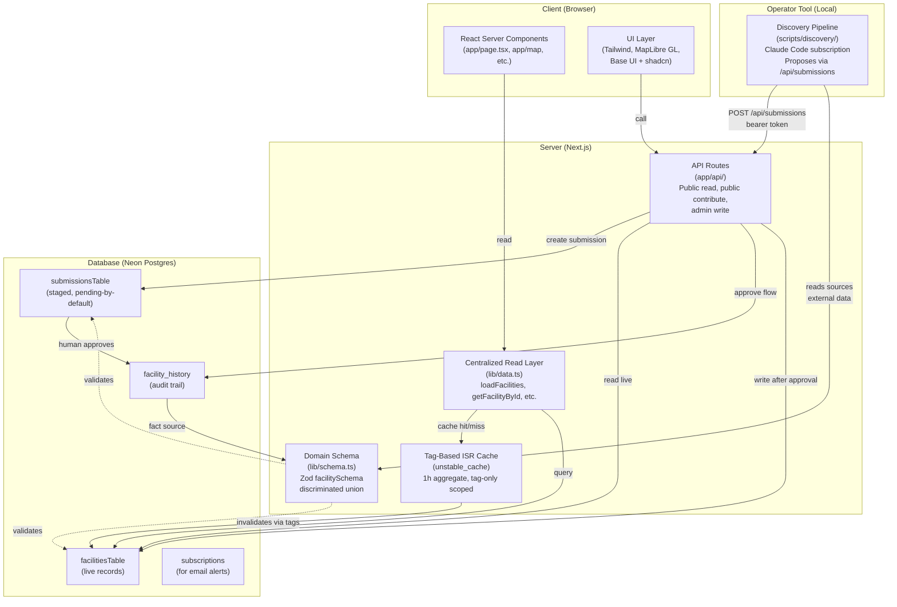

# Architecture: Compute Atlas

Compute Atlas is a source-cited public tracker of AI data centers, crypto-mining sites, and dedicated power-generation facilities in the US. The system comprises three layers: a Next.js 16 frontend with React Server Components, a Neon Postgres backend serving cacheable JSON API responses, and an offline operator tool (the discovery pipeline) that proposes changes to a human-moderated staging queue.

## System Overview

**Frontend:** Next.js 16 App Router with React 19 + TypeScript. Renders facility data via React Server Components; components never query the database directly. Reads are centralized through `lib/data.ts` and served through tag-based `unstable_cache` with ISR (Incremental Static Regeneration). The UI itself is Tailwind v4 with Base UI + shadcn primitives, and features MapLibre GL for the globe view.

**Backend:** Neon serverless Postgres, schema in `lib/db/schema.ts`, accessed via Drizzle ORM. The database holds live facility records, staging submissions, a full audit trail (`facility_history`), and subscription data. All writes flow through the `submissions` table (staged and `pending`-by-default) and require explicit human approval via the `approve` action to become live.

**Discovery Pipeline:** A local, scheduled operator tool (`scripts/discovery/`) that proposes new facilities and status changes to the staging queue. It runs via launchd on the maintainer's machine and never writes live facilities — it's not part of the deployed application.

## Codemap

### Read Path: `lib/data.ts` and Caching

All database reads flow through centralized loaders in `lib/data.ts`. Components and pages call these functions; none query the database directly.

**Public API functions:**
- **`getAllFacilities()`**, **`getFacilityById(id)`**, **`getFacilitiesByState(code)`**, **`getPowerGenerationFacilities()`**, **`getStats()`**, **`getNotableFacilities(n)`**, **`getFacilitiesByStatus(status)`**, **`getFacilitiesByMetro(slug)`**, **`getFacilitiesByOperator(name)`**, and others — all public query functions internally call the cached loaders.

**Cached loaders (internal):**
- **`loadFacilities()`**: Whole-dataset loader, cached for 1 hour with tag `"facilities"`. Backs ~15 aggregate pages (home, map, table, stats, explore lenses, operators/states index, sitemap). Returns deterministically sorted by `id`.
- **`loadFacilitiesForSearch()`**: Same data cached for 24 hours with tag `"facilities"` (the cache key is `"facilities-search"`, but the tag is `"facilities"`). Used only for the global ⌘K search index in the root layout (deliberately decoupled from the 1h timer so the site-wide ISR floor stays long). This tag is inert — nothing calls `revalidateTag("facilities")` on write anymore.
- **Scoped cached readers** (per-facility, per-state, power-generation, etc.): Tag-only, no timer. Revalidated only when writes affect their specific scope.

All loaders read from either Neon (if `DATABASE_URL` is set) or fall back to the bundled JSON file `data/facilities.json` for offline development. In tests (vitest), caching is disabled.

**Why this structure?** Aggregate and detail pages have different revalidation needs. Approving a single facility on prod shouldn't force the whole site to rebuild; scoped tags ensure a write only touches affected pages.

### Write Path: Staging and Human Approval

- **`lib/submissions.ts`**: Envelope-only validation and staging. `createSubmission()` inserts a new `pending` row in the `submissions` table. The full facility schema validation happens later.
- **`lib/facility-write.ts`**: Contains `createFacility()`, `updateFacility()`, and `writeStatusUpdate()` — the only functions that write live facilities to `facilitiesTable`. These always tag-bust the affected scopes and are called only by the approval path.
- **Approval workflow**: Admin calls `/api/submissions/{id}/approve` or the CLI `npm run submissions -- approve <id>`, which calls `approveSubmission()` in `lib/submissions.ts`. This path validates the full `facilitySchema`, calls the write primitive, and emits a `facility_history` audit row.

**Rejection** calls `rejectSubmission()` and leaves the submission as-is; it can be rereviewed or rejected again without re-staging.

### Domain Schema: `lib/schema.ts`

A single source of truth for facility shape, expressed as a Zod discriminated union on `facilityType`:

```
facilitySchema = dataCenterSchema | cryptoMiningSchema | powerGenerationSchema
```

Every facility is one of these three types. Common fields (id, name, operator, location, status, sources, etc.) live in `baseFacilityShape`; each type adds its own fields. For cross-references: `poweredBy` is a base field on all facility types (set on compute records to point to their power source), and `poweredFacilityIds` is nested under `generation` on power-generation facilities (the one-directional source of truth; the reciprocal "Powered by" display is derived at render time).

**Invariant:** No fact enters the system without a citable source. The `sources` array is required and validated by `sourceSchema` (url, label, kind, retrievedAt; publisher is optional). Omit unknown fields rather than fabricate them.

### API Endpoints: `app/api/`

- **Public read:** `/api/facilities` (returns `{count, facilities}` unpaginated, filterable by `?status=`, `?type=`, `?state=`, `?operator=`, `?q=`), `/api/facilities/{id}`, `/api/stats` (aggregate dataset figures: facility count, states, operational/planned/under-construction capacity), `/api/search` (full-text search over the database), `/api/schema` (schema introspection). No authentication. All responses are rate-limited by IP and cached via Cache-Control headers (1h for list/facility/stats, 10m for search, 24h for schema).
- **Public intake:** `POST /api/contribute` (anonymous). Hard-pins `status=pending`, validates with Zod, ignores privileged fields, rate-limits by IP hash. Submissions are human-moderated before going live.
- **Email alerts (double-opt-in):** `POST /api/subscribe` (public; starts subscription), `/api/subscribe/confirm` (confirms via emailed token), `/api/subscribe/unsubscribe` (opts out). No authentication; opt-in is tracked via email and token.
- **Admin write:** `POST /api/submissions`, `/api/submissions/{id}/approve`, `/api/submissions/{id}/reject`. Require `API_ADMIN_TOKEN` bearer. Used by the admin UI and the discovery pipeline.

All responses use the `jsonResponse()` helper for consistent status codes and CORS handling. The `/api/search` endpoint uses Postgres full-text search (the database `search_vector`), not the client-side Fuse.js library (which backs the ⌘K command palette in the UI).

### Map and UI: `components/map/`, `lib/seo.ts`

**MapLibre GL** wraps the map in an imperative layer over React; vector (streets) and satellite (Esri) basemaps are swappable without re-mounting. The globe projection is hardcoded (not a mapbox style) to preserve perspective on layer changes.

**JSON-LD** via `lib/seo.ts` generates structured data: `Dataset` on the homepage, `Place` + `BreadcrumbList` on facility detail pages, `ItemList` on directory pages, and a site-wide `Organization`/`WebSite` graph. The OG image is rendered server-side via Satori (React-to-image).

Collection pages (`/states/{state}`, `/operators/{operator}`, `/power`, `/opposition`, `/status/{status}`, `/metros/{metro}`) all use the shared `components/collection/collection-page.tsx` primitive for consistency.

## Invariants (as Absences)

**1. No direct writes to live facilities.** Every change — new facility, updated coordinates, status change — lands as a `pending` submission and requires human approval. No creation automation, no pipeline writes, no bulk upserts.

**2. No user accounts.** The system uses a single-secret admin token (bearer in Authorization header). The admin UI gates behind a stateless cookie (`admin_session`). This is a durable product decision, not a missing feature.

**3. No reverse flow from the app to `data/facilities.json`.** The JSON file is a read-only export artifact (CC-BY-4.0 licensed separately from code). `npm run db:export` is an operator tool, not part of the runtime.

**4. No fact without a source.** Every submission's `provenance` must cite at least one source. The discovery pipeline and public contributors both validate this.

**5. Every write is audited.** All changes to live facilities are logged to `facility_history` with a full diff (before/after), the submission ID, and the change's provenance. The audit trail is immutable and directly queryable.

## Layer Boundaries and Cross-Cutting Concerns

### Caching Tiers

- **Full-site ISR floor:** 24h (search index in root layout). This is the longest revalidation on the site.
- **Aggregate page cache:** 1h (loadFacilities). Intentionally uncoupled from write events; a write does *not* bust this tag.
- **Scoped page caches:** Tag-only, no timer. Revalidated on write only.

Why decouple? Previous versions busted the global `"facilities"` tag on every write, causing the entire ~700-page site to rebuild. Scoped tags cut that blast radius to 2–3 pages per write.

**Prod-only gotcha:** Neon is the source of truth. `unstable_cache` is Next.js in-memory; a prod data-only change (approving a facility on prod) updates Neon but not the cache until the tag expires or a tagged page is revalidated. The cache survives Neon outages by serving stale data — this is intentional, a feature not a bug, ensuring the site stays read-accessible even during database downtime.

### Provenance Threading

Every submission row carries a `provenance` JSON field recording:
- `sources`: array of source URLs cited for this submission
- `discoveredBy`: who/what proposed it (e.g., "data-wave:run-123" or "manual")
- `confidence`, `runId`, `note`, `submitterIpHash`, `attribution`

On approve, the provenance is preserved in the audit trail (`facility_history`), enabling traceability: given a facility, you can see its full editing history, who proposed each change, and which sources justified it.

### Discovery Pipeline Isolation

`scripts/discovery/` is a local, scheduled operator tool. It:
- Reads published source data (SEC filings, press, permit databases, etc.)
- Proposes new facilities and status changes
- Stages both as `pending` submissions
- **Never** writes live facilities

The pipeline uses the Claude Code subscription (not metered API) and runs via launchd at 13:00. It writes to the same Postgres instance as the runtime via the admin `/api/submissions` endpoint (bearer auth). The approval workflow is identical to public contributor submissions: human reviews the staging queue and approves/rejects.

This isolation means the app's runtime is decoupled from the pipeline's data sources and logic. The pipeline can be updated, paused, or run ad hoc without touching production code.

## Code Structure Diagram



## Operational Considerations

**Offline fallback:** If Neon is unreachable and `DATABASE_URL` is unset, the app falls back to `data/facilities.json`. For local development, `` `DATABASE_URL= npm run dev` `` switches to JSON mode (useful during Neon outages).

**Local discovery runs:** The pipeline is scheduled via launchd but can be invoked ad hoc via `bash scripts/discovery/run.sh` with `DISCOVERY_ENABLED=true` set in the environment. The underlying `claude -p` call uses `--append-system-prompt` with a plain-text batch contract (not JSON) to enforce JSON-only output mode for parsing reliability.

**Admin CLI:** `npm run submissions -- list pending | approve <id> "note" | reject <id> "note"` for staging-queue review and approval.

**Source exports:** `npm run db:export` writes the live facility set back to `data/facilities.json` for distribution (CC-BY-4.0 separate license).

## Trade-offs and Lessons

**Why Drizzle over raw SQL?** Type safety on queries and migrations without heavyweight ORMs like Prisma. Drizzle stays close to SQL.

**Why tag-based ISR over time-based?** Aggregates have natural revalidation timers (1h is acceptable staleness for stats); scoped pages need immediate refresh on change. Mixing both (tags + timers) gives fine-grained control.

**Why no time-based full cache invalidation?** Previous versions used `revalidate: 300` (5 min), causing prod cache rot during outages. The current model: scoped tags bust immediately, aggregates use a cheap long timer (1h), search index stays 24h.

**Why no user accounts?** Contributor attribution is optional; the admin UI is for one operator. User accounts add auth complexity, session management, and account recovery. For a single-operator tool, the bearer token is simpler and sufficient. This is a durable design choice, not a placeholder pending features.

**Why stage before approval?** Submissions are cheap to generate (pipeline, public form); approval is where rigor happens. This decouples discovery velocity (fast, automated) from publication discipline (human-gated).

**Why keep the pipeline local?** It needs access to real-time SEC filing APIs, press databases, and permit systems — all require complex scraping and source debouncing. Hosting it serverless (Lambda) adds latency and cold-start costs; launchd on a developer machine with persistent state is simpler and cheaper.

## Further Reading

- **Data model:** `lib/schema.ts` — Zod schemas for all facility types and enums.
- **DB migrations:** `drizzle/` — Drizzle migration files; apply with `npm run db:migrate`.
- **Discovery pipeline:** `scripts/discovery/` and `docs/discovery-pipeline.md` — methodology and source enumeration.
- **Public contribution:** `CONTRIBUTING.md` — editorial standards for source-cited data.
