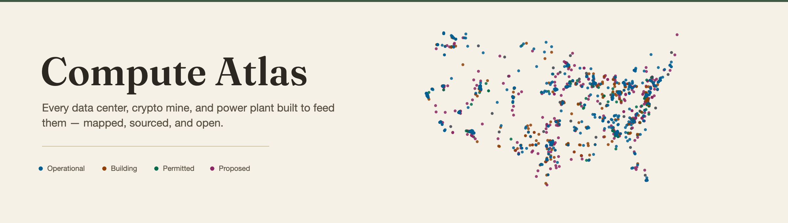
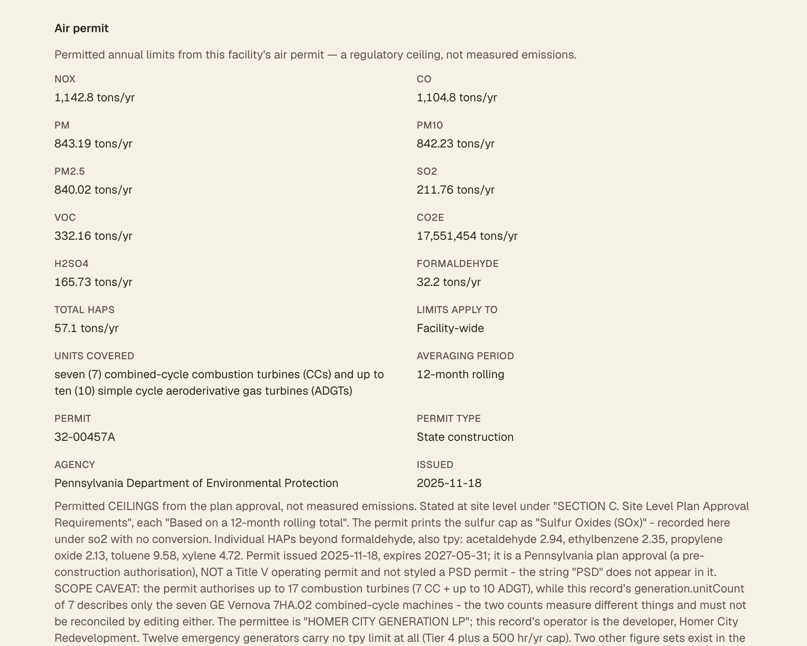
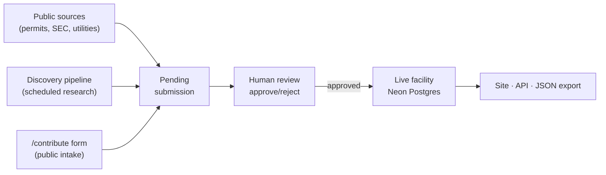

<p align="center">
  <a href="https://www.compute-atlas.com"></a>
</p>

<p align="center">
  <strong>There is no national registry of data centers.</strong><br>
  This is the closest thing — and every record shows its sources.
</p>

<p align="center">
  <a href="https://github.com/ek33450505/compute-atlas/actions/workflows/ci.yml"></a>
  <a href="https://www.compute-atlas.com/api/stats"></a>
  <a href="https://www.compute-atlas.com/api/stats"></a>
  <a href="LICENSE"></a>
  <a href="LICENSE-DATA"></a>
</p>

<p align="center">
  <a href="https://www.compute-atlas.com">Live site</a> ·
  <a href="https://www.compute-atlas.com/map">Map</a> ·
  <a href="https://www.compute-atlas.com/api">API</a> ·
  <a href="docs/methodology.md">Methodology</a> ·
  <a href="CONTRIBUTING.md">Contributing</a> ·
  <a href="data/facilities.json">Raw data</a>
</p>

---

Compute Atlas is an open, source-cited dataset of **data centers, crypto-mining sites, and
the dedicated power generation built to supply them** across the United States — from
proposed and permitted through under construction and operational.

It also tracks the civic footprint of these facilities: energy, water, subsidies, jobs,
emissions, and community reception. That information is public, but it is scattered across
county planning portals, air-permit PDFs, utility interconnection queues, and local
reporting — and assembling it is genuinely hard. That is the gap this closes.

Built for journalists, researchers, local officials, and the people who live next to
these sites.

---

## See the data

**The map** — every tracked facility, filterable by status, operator, type, and capacity.

[](https://www.compute-atlas.com/map)

**A record** — every fact carries a source, and every source carries a retrieval date.
`sourceIndex` points a specific claim at the specific document that backs it.

```jsonc
{
  "id": "xai-colossus-memphis-tn",
  "name": "Colossus",
  "operator": "xAI",
  "status": "operational",
  "confidence": "reported",          // confirmed | reported | rumored
  "location": { "lat": 35.0565, "lon": -90.0148,
                "city": "Memphis", "county": "Shelby", "state": "TN" },
  "capacityMw": { "planned": 1200, "operational": 150 },
  "statusHistory": [
    { "status": "under_construction", "date": "2024-06", "sourceIndex": 0,
      "note": "Construction began; completed in approximately 122 days" },
    { "status": "operational", "date": "2024-09", "sourceIndex": 1,
      "note": "Phase 1 online with ~100,000 NVIDIA H100 GPUs" }
  ],
  "sources": [
    { "url": "https://…", "publisher": "Reuters", "kind": "press",
      "label": "Musk says xAI has built world's most powerful AI training cluster",
      "retrievedAt": "2026-07-05" }
  ]
}
```

**The API** — public, CORS-open, no authentication.

```console
$ curl -s 'https://www.compute-atlas.com/api/stats'   # real response, 2026-09-01
{"count":1331,"states":50,"operationalMw":27350.639999999996,
 "plannedMw":338247.5,"underConstructionMw":111329.2}
```

The figures above are a point-in-time snapshot; the live endpoint is the authority.

**Air permits** — where a permit exists, its permitted ceilings are recorded verbatim from
the document, never derived, and always labelled as a regulatory ceiling rather than
measured emissions.

[](https://www.compute-atlas.com/facilities/homer-city-energy-campus-generation-pa)

---

## What makes it different

**Absence means "we don't know", never "zero".** A missing field is an unfilled gap, not a
finding. Pages that aggregate a field say what share of records actually disclose it, so a
total built from half the data never gets presented as a total.

**Numbers only when firm.** Ranges, ceilings, and modeled projections go in a record's
notes — never into a numeric field. A multi-year subsidy total is described in the program
label rather than asserted as one dollar amount. Statutory *eligibility* for an incentive
is not recorded as a confirmed award. Derived figures are forbidden outright: no number
enters the dataset that isn't stated in a source.

**Nothing publishes itself.** Every candidate — from the automated discovery pipeline or
the public contribution form — lands as a `pending` row and requires an explicit human
approval. That is the core invariant of the project.

**Machine-checked provenance.** Candidates from the discovery pipeline have each cited URL
fetched and mechanically compared against the claim it supports before staging, using a
local model on the maintainer's machine. A claim its own source doesn't make gets rejected.

**Corrections are expected, not tolerated.** Coverage grows and records get things wrong;
`/activity` shows every change, and a correction with a source is the most welcome thing
you can send.

---

## How the data is built

Compiled by hand from primary sources — county planning portals, SEC filings, state
air-quality permits, ISO/RTO interconnection queues, utility filings, and subsidy
disclosures — with a deliberate bias against fabrication. Every facility cites at least one
public source with a URL, a label, a source `kind`, and a retrieval date.

For the discovery channels, the sourcing and verification standard, and how to read a
record's sources, see **[docs/methodology.md](docs/methodology.md)**.

### The intake pipeline



---

## Using the data

Three ways in, all free and all attributed under CC BY 4.0:

| | |
|---|---|
| **Browse** | The [map](https://www.compute-atlas.com/map) and [table](https://www.compute-atlas.com/table), or [explore](https://www.compute-atlas.com/explore) by [state](https://www.compute-atlas.com/states), [operator](https://www.compute-atlas.com/operators), [metro](https://www.compute-atlas.com/metros), [power](https://www.compute-atlas.com/power), [status](https://www.compute-atlas.com/status), [crypto](https://www.compute-atlas.com/crypto), and [community opposition](https://www.compute-atlas.com/opposition) |
| **API** | `GET /api/facilities`, `/api/facilities/{id}`, `/api/search`, `/api/stats`, `/api/schema` — CORS-open, no auth, rate-limited by IP, served with `X-License: CC-BY-4.0`. Full contract at [`/api`](https://www.compute-atlas.com/api) |
| **Bulk** | [`data/facilities.json`](data/facilities.json) — the complete dataset as one forkable file |

Writes are moderated: `POST /api/contribute` stages a candidate for human review and
`POST /api/leads` submits a URL tip-off. Submission management requires an admin token.

The JSON snapshot lags the live site — it is regenerated once per data wave, and its `asOf`
timestamp is recorded in [`data/facilities.meta.json`](data/facilities.meta.json). For
always-current figures use the API or the
[statistics page](https://www.compute-atlas.com/stats). **Counts are deliberately not
hardcoded in this README** so they can never drift from the data; the badges above read
live from `/api/stats`.

### Citing it

> Compute-infrastructure data from Compute Atlas by Edward Kubiak, licensed under
> CC BY 4.0 — https://github.com/ek33450505/compute-atlas

---

## Data model

Records are validated against the Zod schema in
[`lib/schema.ts`](lib/schema.ts) — a discriminated union on `facilityType`. The test suite
validates every record on every pull request, so a malformed record fails CI.

| Field | Description |
|---|---|
| `facilityType` | The discriminator: `data_center` / `crypto_mining` / `power_generation` |
| `id` | Lowercase kebab slug (e.g. `xai-colossus-memphis-tn`) |
| `name` · `operator` | Facility name and operating company |
| `status` | `proposed` / `permitted` / `under_construction` / `operational` / `cancelled` |
| `confidence` | `confirmed` / `reported` / `rumored` |
| `aiClassification` | `confirmed` / `likely` / `mixed_use` (data-center and crypto records) |
| `location` | `lat`, `lon`, `city?`, `county?`, `state` (2-letter) |
| `capacityMw` | `planned?` and/or `operational?` in megawatts |
| `statusHistory` | Ordered status transitions with dates and source references |
| `sources` | At least one source with `url`, `label`, `kind`, `retrievedAt` |
| `lastUpdated` | ISO date (`YYYY`, `YYYY-MM`, or `YYYY-MM-DD`) |

Plus type-specific blocks (`mining`, `generation`, `environmental`) and civic fields
(`energy`, `water`, `emissions`, `subsidies`, `jobs`, `community`).

---

## Contributing and corrections

Every submission needs a public source URL. That is the only hard requirement.

- **Know a facility we're missing?** Use the
  [New Facility form](https://github.com/ek33450505/compute-atlas/issues/new/choose) — no
  code required — or the [contribute page](https://www.compute-atlas.com/contribute).
- **Spot an error?** [Open a correction](CONTRIBUTING.md) with a source. Errors are
  expected and fixing them is the point.
- **Questions or ideas?**
  [Discussions](https://github.com/ek33450505/compute-atlas/discussions).
- **Security concerns** should be reported privately — see [SECURITY.md](SECURITY.md).

See **[CONTRIBUTING.md](CONTRIBUTING.md)** for the standard the data is held to.
Participation is governed by our [Code of Conduct](CODE_OF_CONDUCT.md).

---

## Development

```bash
npm install
npm run dev        # dev server at http://localhost:3000
npm test           # unit + integration (Vitest)
npm run test:e2e   # a11y + e2e (Playwright — requires npm run build first)
npm run build      # production build
npm run lint       # ESLint
npm run typecheck  # tsc --noEmit
```

Running without `DATABASE_URL` set renders from the `data/facilities.json` snapshot, so you
can develop the whole site without touching a database.

Data integrity is checked by the test suite, not the build:
`lib/data-integrity.test.ts` validates every record against the Zod schema, so `npm test`
fails loudly on a missing required field or a malformed record. Note it reads whatever
`lib/data.ts` resolves to — run it *without* `DATABASE_URL` to validate the snapshot rather
than the live database.

**Stack:** Next.js 16 (App Router, RSC) · React 19 · TypeScript · Zod · Neon Postgres +
Drizzle · MapLibre GL · Tailwind v4 + shadcn/ui · Vitest + Testing Library · Playwright.
The discovery pipeline uses local Ollama models on the maintainer's machine and is not part
of the deployed app.

> **Maintainers:** the data-wave workflow, database scripts, environment variables, release
> process, and caching model live in **[docs/maintainers.md](docs/maintainers.md)**.

---

## Accessibility

Compute Atlas targets **WCAG 2.2 AA**. The data table is a first-class alternative to the
map — every facility is reachable and filterable without pointer interaction. Focus
indicators, a skip-to-content link, semantic HTML, and `prefers-reduced-motion` support are
used throughout, and the end-to-end suite runs automated accessibility audits on every major
route.

## Accuracy, neutrality, and disclaimer

Compute Atlas is non-partisan and takes no position for or against any facility or operator;
it aims only to make public information findable and verifiable. The dataset is compiled
from public sources and is necessarily incomplete and subject to revision — which is why
every record carries an explicit confidence level and cites its sources. It is provided
"as is", without warranty of any kind, and is **not** legal, financial, investment, or
professional advice. If you spot an error, please [open a correction](CONTRIBUTING.md) with
a source.

## License

Dual-licensed:

- **Code** — [MIT](LICENSE)
- **Data** (`data/`) — [CC BY 4.0](LICENSE-DATA). Reuse freely, including commercially;
  please attribute.

Third-party data keeps its own terms: the basemap is © OpenStreetMap contributors (ODbL)
via OpenFreeMap, and any figures attributed to Epoch AI are CC BY 4.0.

---

<p align="center">
  An independent project by <strong>Edward Kubiak</strong>.<br>
  <a href="https://www.compute-atlas.com">www.compute-atlas.com</a>
</p>
