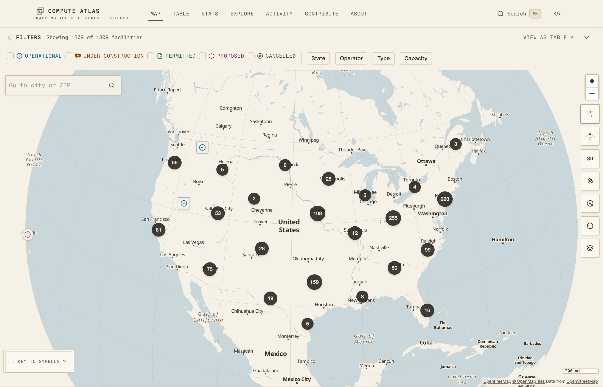
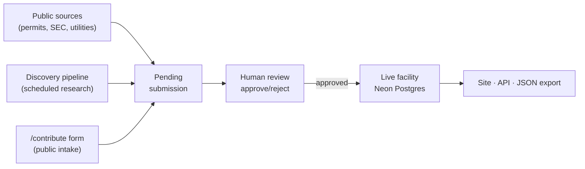

# Compute Atlas

[](https://www.compute-atlas.com)

[](https://github.com/ek33450505/compute-atlas/actions/workflows/ci.yml)
[](https://www.compute-atlas.com/api/stats)
[](https://www.compute-atlas.com/api/stats)
[](LICENSE)
[](LICENSE-DATA)

An open, source-cited dataset of data centers, crypto-mining sites, and dedicated power generation across the United States — from proposed and permitted to under construction and operational — with a public source behind every record.

**Live site → [www.compute-atlas.com](https://www.compute-atlas.com)**

## What it is

There is no national registry of data centers. "Data center" spans a wide range of facility types — Compute Atlas curates a provenance-first dataset covering traditional and hyperscale compute, AI/ML-specific campuses, crypto-mining operations, and the dedicated power generation built or contracted to supply these campuses, drawn from public permit filings, utility interconnection queues, company announcements, and subsidy disclosures. Every record carries a confidence level and links its sources.

The project also tracks the civic footprint of these facilities — energy, water, subsidies, jobs, and community impact — because that information is public but scattered across county records, water-authority applications, and local reporting, and assembling it is genuinely hard. That's the gap the atlas tries to close.

Intended audience: journalists, researchers, local officials, and residents.

## The numbers

The live facility and state counts are shown in the badges above (read live from the public **[`/api/stats`](https://www.compute-atlas.com/api/stats)** endpoint, so they never drift). For the full, always-current breakdown — status, states, operators, capacity, and reported water use — see the live **[Statistics page](https://www.compute-atlas.com/stats)**, or read the raw data in [`data/facilities.json`](data/facilities.json). That snapshot lags the live site: it is regenerated once per data wave, and its `asOf` timestamp is recorded in [`data/facilities.meta.json`](data/facilities.meta.json). Figures are intentionally not hardcoded in this README so they never drift from the data.

## How the data is built

Compute Atlas is compiled by hand from primary sources, with a deliberate bias against fabrication:

- **A source for every record.** Each facility cites at least one public source with a URL, a label, a source `kind`, and a retrieval date. Nothing is recorded without provenance.
- **Honest confidence.** Records are marked `confirmed`, `reported`, or `rumored`, and data-center facilities with a discernible AI angle are additionally classified `confirmed`, `likely`, or `mixed_use`. Uncertainty is surfaced, not hidden.
- **Numbers only when firm.** Ranges, ceilings, and modeled projections go in a record's notes — never into a numeric field. Multi-year subsidy totals are described in the program label rather than asserted as a single dollar amount. Statutory *eligibility* for an incentive is not recorded as a confirmed award.
- **Independent verification.** Consequential claims (capacity, investment, subsidies) are checked against the underlying filing or announcement before they enter the dataset.
- **Additive and correctable.** Coverage grows over time; corrections are welcome and expected. See [CONTRIBUTING.md](CONTRIBUTING.md).

For the full methodology — the discovery channels (county planning portals, SEC filings, ISO/RTO queues), the sourcing and verification standard, and how to read a record's sources — see [docs/methodology.md](docs/methodology.md).

### The intake pipeline



Candidates from the scheduled discovery pipeline are checked before they are staged: each cited URL is fetched and mechanically compared against the claim it supports, using a local model on the maintainer's machine. Nothing becomes a live facility without human approval—the core invariant of the project.

## API

Compute Atlas exposes a public, CORS-open JSON API — no authentication, rate-limited by IP, CDN-cached, and served with `X-License: CC-BY-4.0` attribution headers. The read endpoints are `GET /api/facilities`, `/api/facilities/{id}`, `/api/search`, `/api/stats`, and `/api/schema`. Writes are moderated: `POST /api/contribute` stages a candidate facility for human review, `POST /api/leads` submits a URL tip-off, and the submission-management endpoints require an admin bearer token.

Full contract — parameters, response shapes, rate limits, and examples — is documented at [`/api`](https://www.compute-atlas.com/api) on the live site.

## Data & database

Compute Atlas data is backed by **Neon Postgres** (via **Drizzle ORM**). The authoritative source is the database; the published `data/facilities.json` is a read-only **CC-BY snapshot** exported from the DB and remains the forkable artifact for users.

**Data flow discipline.** `data/facilities.json` is a generated artifact — it is never hand-edited to publish a change. Every data wave runs in one direction, DB first:

1. `npm run db:sync` — dry run by default; prints the plan of adds and updates for review.
2. `npm run db:sync -- --apply` — publishes adds and updates, writes `facility_history`, and busts the affected cache tags.
3. `npm run db:export` — regenerates `data/facilities.json` from the live database.
4. `npm run build:mapdata` — regenerates the static map overlays and per-facility siting context.
5. Commit the regenerated files.

`npm run db:seed` is bootstrap-only, for filling an empty database from the JSON; its `--force` variant writes no history and busts no cache tags, so it is not a publish path.

## Releases and versioning

Compute Atlas follows [Semantic Versioning](https://semver.org). Releases are published via [GitHub Releases](https://github.com/ek33450505/compute-atlas/releases) and automated with release-please; see [CHANGELOG.md](CHANGELOG.md) for changes. Each release exports a versioned snapshot: `data/facilities.json` carries an `asOf` timestamp so consumers can track data currency.

**Database scripts** (all require `DATABASE_URL` in `.env.local`):

- `npm run db:generate` — Generate Drizzle schema migrations.
- `npm run db:migrate` — Run pending migrations against the database.
- `npm run db:sync` — Diff `data/facilities.json` against the database and print the plan; `-- --apply` publishes it.
- `npm run db:export` — Write the live database to `data/facilities.json`.
- `npm run build:mapdata` — Rebuild the static map overlays and siting context from public sources.
- `npm run check:drift` — Read-only report of any drift between the JSON snapshot and the database.
- `npm run db:seed` — Bootstrap-only: populate an empty database from `data/facilities.json`.

Required environment variables (see `.env.example`):

- `DATABASE_URL` — Neon Postgres pooled connection string.
- `API_ADMIN_TOKEN` — Bearer token for admin write API access.

## Data model

Facility records are validated against the Zod schema in `lib/schema.ts`.

Key fields per facility:

| Field | Description |
|---|---|
| `facilityType` | The discriminator: `data_center` / `crypto_mining` / `power_generation` |
| `id` | Lowercase kebab slug (e.g. `xai-colossus-memphis-tn`) |
| `name` | Facility name |
| `operator` | Operating company |
| `status` | `proposed` / `permitted` / `under_construction` / `operational` / `cancelled` |
| `aiClassification` | `confirmed` / `likely` / `mixed_use` (data-center and crypto-mining records only) |
| `confidence` | `confirmed` / `reported` / `rumored` |
| `location` | `lat`, `lon`, `city?`, `county?`, `state` (2-letter) |
| `capacityMw` | `planned?` and/or `operational?` in megawatts |
| `statusHistory` | Ordered list of status transitions with dates and source references |
| `sources` | At least one source with `url`, `label`, `kind`, and `retrievedAt` |
| `lastUpdated` | ISO date string (YYYY or YYYY-MM or YYYY-MM-DD) |

Plus type-specific blocks (`mining`, `generation`, `environmental`) and civic fields (`energy`, `water`, `subsidies`, `jobs`, `community`) — see `lib/schema.ts`.

## Contributing and corrections

Contributions and corrections are welcome — every submission needs a public source URL. See **[CONTRIBUTING.md](CONTRIBUTING.md)** for how to propose a new facility or a correction, and the standard the data is held to. Participation is governed by our [Code of Conduct](CODE_OF_CONDUCT.md).

**New to the project?** Use the [New Facility form](https://github.com/ek33450505/compute-atlas/issues/new/choose) to add a facility you know about — no code required. Questions or ideas? Post in [Discussions](https://github.com/ek33450505/compute-atlas/discussions). Security concerns should be reported privately; see [SECURITY.md](SECURITY.md).

## Tech stack

- **Next.js 16** (App Router, React Server Components, incremental static regeneration) with **React 19**
- **Neon Postgres** + **Drizzle ORM** for the data layer
- **TypeScript** + **Zod** for runtime-validated data and JSON Schema export
- **MapLibre GL** + **react-map-gl** for the interactive map
- **Tailwind CSS v4** + **shadcn/ui** components
- **Vitest** + **React Testing Library** for the unit-test suite
- **Playwright** for end-to-end tests
- **Ollama** (local models, maintainer's machine only) for source verification in the discovery pipeline — not part of the deployed app

## Local development

```bash
npm install
npm run dev        # start dev server at http://localhost:3000
npm run test       # run unit tests (Vitest)
npm run test:e2e   # run E2E tests (Playwright — requires npm run build first)
npm run build      # production build
npm run lint       # ESLint
npm run typecheck  # TypeScript type check
```

Data integrity is checked by the test suite, not the build: `lib/data-integrity.test.ts` validates every record against the Zod schema in `lib/schema.ts`, so `npm test` fails loudly on a missing required field or a malformed record. CI runs it on every pull request. Note it reads whatever `lib/data.ts` resolves to — run it *without* `DATABASE_URL` set to validate the `data/facilities.json` snapshot rather than Neon.

## Accessibility

Compute Atlas targets **WCAG 2.2 AA**. The data table is a first-class alternative to the map — all facilities are reachable and filterable without pointer interaction. Focus indicators, a skip-to-content link, and semantic HTML are used throughout, and the end-to-end suite runs automated accessibility audits on every major route.

## Accuracy, neutrality, and disclaimer

Compute Atlas is non-partisan and takes no position for or against any facility or operator; it aims only to make public information findable and verifiable. The dataset is compiled from public sources and is necessarily incomplete and subject to revision — which is why every record carries an explicit confidence level and cites its sources. It is provided "as is," without warranty of any kind, and is **not** legal, financial, investment, or professional advice. If you spot an error, please [open a correction](CONTRIBUTING.md) with a source.

## License

This project is dual-licensed:

- **Source code** — [MIT License](LICENSE).
- **Data** (`data/`) — [Creative Commons Attribution 4.0 International (CC BY 4.0)](LICENSE-DATA). Reuse freely, including commercially; please attribute.

Third-party data keeps its own terms: the map basemap is © OpenStreetMap contributors (ODbL) via OpenFreeMap, and any figures attributed to Epoch AI are CC BY 4.0.

## Attribution

Compute Atlas is an independent project by **Edward Kubiak**.

Suggested citation:

> Compute-infrastructure data from Compute Atlas by Edward Kubiak, licensed under CC BY 4.0 — https://github.com/ek33450505/compute-atlas
